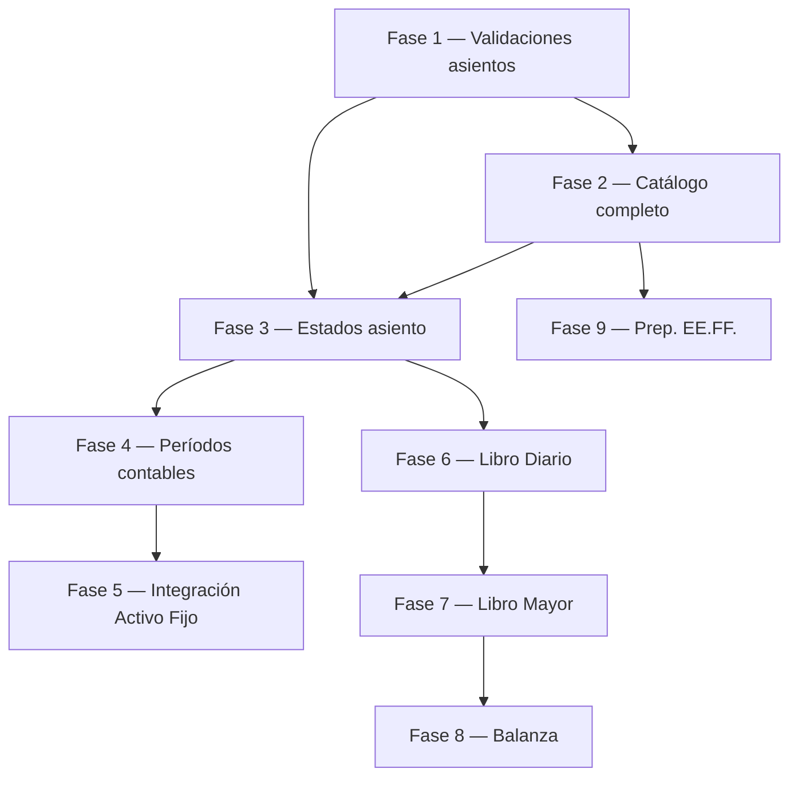

# Plan de Implementación — Módulo de Contabilidad General [PENDING]

## Contexto y diagnóstico del proyecto actual

El proyecto es un **Monolito Modular Laravel 12 + Inertia.js + React + PrimeReact**. La arquitectura modular bajo `app/Modules/` es sólida y debe mantenerse. El módulo `Accounting` ya existe y tiene una base útil pero incompleta. Antes de planificar las fases, es crítico entender exactamente qué ya existe y qué problemas tiene.

---

## 🔍 Estado actual del módulo Accounting — Qué existe y qué falta

### ✅ Ya existe y puede reutilizarse

| Elemento | Archivo | Estado |
|---|---|---|
| Tabla `accounting_accounts` | `create_accounting_tables` | ✅ Funcional con árbol jerárquico |
| Tabla `journal_entries` | `create_accounting_tables` | ⚠️ Funcional pero incompleta (ver problemas) |
| Tabla `journal_entry_lines` | `create_accounting_tables` | ✅ Funcional |
| FKs de `asset_types` a cuentas | `add_accounting_fields_to_asset_types` | ✅ Funcional |
| `AccountingAccount` model | `Models/AccountingAccount.php` | ⚠️ Falta campo `permite_movimientos` |
| `JournalEntry` model | `Models/JournalEntry.php` | ⚠️ Falta campo `numero_asiento`, `periodo_id` |
| `JournalEntryLine` model | `Models/JournalEntryLine.php` | ✅ Funcional |
| `JournalEntryService` | `Services/JournalEntryService.php` | ⚠️ Validaciones parciales (ver problemas) |
| `JournalEntryController` | `Http/Controllers/` | ⚠️ Mezcla lógica de Fase 1 y Fase 5, falta gestión de estados |
| `AccountingAccountController` | `Http/Controllers/` | ⚠️ Falta campo `permite_movimientos` |
| `CreateDepreciationJournalEntry` listener | `Listeners/` | ⚠️ Usa evento `AssetDepreciated` que no está implementado aún |
| Frontend — TreeTable de cuentas | `Pages/Accounting/Accounts/Index.jsx` | ✅ Funcional |
| Frontend — Crear asiento manual | `Pages/Accounting/JournalEntries/Create.jsx` | ⚠️ Falta validaciones Fase 1 |
| Frontend — Index asientos | `Pages/Accounting/JournalEntries/Index.jsx` | ⚠️ Falta filtros, estado "borrador", anulación |
| `AssetType` relación con cuentas contables | `Models/AssetType.php` | ⚠️ `BelongsTo` usa clase sin importar |
| Spatie Activity Log | Migración instalada | ✅ Funcional para trazabilidad |

### ❌ Problemas detectados que deben corregirse antes de continuar

1. **`AssetType.php` usa `BelongsTo` sin importar el trait.** Las relaciones `expenseAccount()` y `accumulatedAccount()` fallarán en runtime porque `BelongsTo` no está importado.

2. **El estado inicial de `journal_entries` es `'validado'`** — El código fuerza `'estado' => 'validado'` en todos los `store()` manuales. Esto viola el requerimiento de "borrador → contabilizado". Se saltó la etapa de borrador.

3. **El valor de `estado` enum actual usa `'validado'`** — El requerimiento define `contabilizado` como nombre correcto. Hay que alinear nomenclatura antes de agregar lógica de estados.

4. **`JournalEntryService` no valida que haya al menos una línea al Debe y una al Haber.** Solo valida que cuadren. Una entrada de `[{debe: 100, haber: 100}]` en una sola línea sería rechazada correctamente por la regla "no puede tener ambos", pero si alguien pusiera dos líneas en cero con las mismas cuentas, pasaría.

5. **`journal_entries` no tiene `numero_asiento`.** El Libro Diario necesita un número correlativo. Actualmente solo se usa el `id` autoincremental, lo que es frágil.

6. **`accounting_accounts` no tiene campo `permite_movimientos`.** No hay forma de distinguir cuentas agrupadoras de cuentas operativas.

7. **Las rutas de accounting en `web.php` no tienen `permission:` guard**, a diferencia del resto del sistema.

8. **El cierre mensual de depreciación verifica duplicados por `asset_id + año + mes`**, pero hace un query directo de `JournalEntry`. Si se agrega un modelo de Período Contable, esta lógica necesitará actualizarse para no permitir asientos en períodos cerrados.

9. **`AssetType` no incluye `cuenta_gasto_depreciacion_id` y `cuenta_depreciacion_acumulada_id` en `$fillable`**, lo cual impide actualizarlos vía mass-assignment.

---

## 🗺️ Mapa de entidades propuestas

```
accounting_periods (NUEVO)
  - id, año, mes, fecha_inicio, fecha_fin, estado (abierto/cerrado)
  - unique(año, mes)

accounting_accounts (MODIFICAR — agregar campo)
  - id, parent_id, codigo, nombre, tipo, estado, nivel
  - + permite_movimientos (boolean, default: true)

journal_entries (MODIFICAR — cambiar enum + agregar campos)
  - id, numero_asiento (string, unique), fecha
  - descripcion, asset_id (nullable), tipo_origen
  - - estado: borrador, validado, anulado ← cambiar "validado" a "contabilizado"
  - + estado: borrador, contabilizado, anulado
  - + periodo_id (FK -> accounting_periods, nullable al inicio)
  - + anulado_por_id (FK -> journal_entries, nullable — apunta al asiento de contrapartida)

journal_entry_lines (sin cambios)
  - id, journal_entry_id, accounting_account_id, debe, haber
  - + concepto (string nullable — permite descripción por línea, útil para Libro Mayor)
```

---

## 📋 Fases de Implementación

---

### FASE 1 — Refactoring y corrección de validaciones en asientos manuales
**Objetivo:** Corregir problemas existentes y fortalecer las reglas de negocio del asiento manual antes de agregar funcionalidades nuevas.

**Prioridad: BLOQUEANTE para el resto de fases.**

#### Base de datos
- Agregar campo `permite_movimientos` (boolean, default: `true`) a `accounting_accounts`
- Agregar campo `concepto` (string nullable) a `journal_entry_lines`
- Agregar campo `numero_asiento` (string, unique) a `journal_entries`
- **Renombrar enum `'validado'` → `'contabilizado'`** en `journal_entries.estado`
  > ⚠️ Migración de datos necesaria si hay registros existentes: `UPDATE journal_entries SET estado = 'contabilizado' WHERE estado = 'validado'`

#### Backend — Reglas de negocio a agregar en `JournalEntryService`
1. ✅ Ya existe: Una línea no puede tener Debe y Haber > 0 simultáneamente
2. ❌ Falta: Una línea no puede quedar con ambos en cero → `if ($debe === 0 && $haber === 0) throw Exception`
3. ❌ Falta: Debe existir al menos una línea con Debe > 0 → validar `$totalDebe > 0`
4. ❌ Falta: Debe existir al menos una línea con Haber > 0 → validar `$totalHaber > 0`
5. ✅ Ya existe: Suma Debe = Suma Haber (tolerancia 0.001)
6. ❌ Falta: Cuenta debe ser operativa (`permite_movimientos = true`) — cargar la cuenta y validar
7. ❌ Falta: Los montos deben ser mayores a cero (ya está el `min:0` pero falta en service)
8. ✅ Ya existe: Mínimo 2 líneas

#### Backend — Correcciones adicionales
- Importar `BelongsTo` en `AssetType.php`
- Agregar `cuenta_gasto_depreciacion_id` y `cuenta_depreciacion_acumulada_id` al `$fillable` de `AssetType`
- Agregar `numero_asiento` y `concepto` a los fillables correspondientes
- Generar `numero_asiento` automáticamente al crear (formato: `ASI-YYYYMM-00001`)
- Agregar guard de permisos `permission:accounting.view` en rutas web del módulo contable

#### Frontend
- Mostrar `numero_asiento` en el formulario Create (solo lectura, pre-generado)
- Mejorar validaciones UI ya existentes: mensaje específico cuando una línea tiene ambos en cero
- Deshabilitar Debe si Haber > 0 y viceversa en la misma línea
- Filtrar el dropdown de cuentas para mostrar solo `permite_movimientos = true`
- Mostrar el campo `numero_asiento` en el Index y en el detalle del asiento

#### Dependencias: Ninguna. Esta fase es el punto de partida.

---

### FASE 2 — Catálogo de cuentas completo
**Objetivo:** Completar el catálogo jerárquico con el campo `permite_movimientos` y mejorar su gestión.

#### Base de datos
- La migración de `permite_movimientos` se hace en Fase 1 (ambas van juntas)

#### Backend
- Actualizar `AccountingAccountController.store()` para aceptar y guardar `permite_movimientos`
- Actualizar `AccountingAccountController.update()` para aceptar `permite_movimientos`
- **Regla de negocio:** Una cuenta con hijos (`children` con registros) NO puede tener `permite_movimientos = true` — al crear una subcuenta, el padre debe cambiar automáticamente a `permite_movimientos = false`
- **Regla de negocio:** Una cuenta inactiva no puede recibir movimientos
- Actualizar `buildTree()` para incluir `permite_movimientos` en el árbol
- Actualizar `apiIndex` plano para incluir `permite_movimientos` en los resultados

#### Frontend
- Agregar toggle `Permite movimientos` en el formulario de cuenta
- Mostrar indicador visual en el TreeTable: candado si es agrupadora, check si es operativa
- En el dropdown de `JournalEntries/Create.jsx`, filtrar por `permite_movimientos: true`

#### Dependencias: Fase 1

---

### FASE 3 — Estados de asientos (borrador → contabilizado → anulado)
**Objetivo:** Implementar el ciclo de vida completo de un asiento contable con inmutabilidad post-contabilización.

#### Base de datos
- Ya cubierto en Fase 1 (cambio del enum)
- Agregar campo `anulado_por_id` (FK nullable a `journal_entries`) en `journal_entries`
- Agregar `contabilizado_en` (timestamp nullable) y `contabilizado_por_id` (FK a `users`, nullable)

#### Backend — Nuevas acciones en `JournalEntryController`
- `POST /api/accounting/journal-entries` → crea en estado `borrador`
- `PUT /api/accounting/journal-entries/{entry}` → solo si está en `borrador`
- `POST /api/accounting/journal-entries/{entry}/contabilizar` → cambia a `contabilizado`
  - Registrar `contabilizado_en`, `contabilizado_por_id`
  - Registrar en `activity_log` vía Spatie
- `POST /api/accounting/journal-entries/{entry}/anular` → genera asiento de contrapartida
  - El asiento original queda en `anulado`
  - Se crea un nuevo asiento espejo (Debe ↔ Haber invertidos) en estado `contabilizado`
  - El nuevo asiento guarda `tipo_origen = 'anulacion'` y se relaciona con el original vía `anulado_por_id`
  - **Regla:** Solo se puede anular un asiento `contabilizado`. Un borrador simplemente se elimina.

#### Reglas de negocio
- Asientos automáticos de depreciación se crean directamente en `contabilizado` (sin pasar por borrador)
- Los asientos en estado `contabilizado` o `anulado` son **inmutables**
- La anulación nunca borra datos, siempre crea contrapartida

#### Frontend
- En `JournalEntries/Create.jsx`: guardar como borrador vs "Guardar y Contabilizar"
- En `JournalEntries/Index.jsx`:
  - Badge de estado diferenciado (borrador=gris, contabilizado=verde, anulado=rojo)
  - Botón "Contabilizar" visible solo en borradores
  - Botón "Anular" visible solo en contabilizados
  - Confirmación de diálogo antes de anular

#### Dependencias: Fase 1, Fase 2

---

### FASE 4 — Períodos contables
**Objetivo:** Crear períodos contables y asociar asientos a ellos para controlar acceso por período.

#### Base de datos — Nueva tabla `accounting_periods`
```
accounting_periods:
  - id
  - año (integer)
  - mes (integer, nullable — null si es período anual)
  - fecha_inicio (date)
  - fecha_fin (date)
  - estado: abierto / cerrado
  - cerrado_en (timestamp nullable)
  - cerrado_por_id (FK users, nullable)
  - timestamps
  - unique(año, mes)
```

- Agregar `periodo_id` (FK nullable → `accounting_periods`) a `journal_entries`

#### Backend — Nuevo `AccountingPeriodController`
- `GET /api/accounting/periods` → listar períodos
- `POST /api/accounting/periods` → crear período
- `PUT /api/accounting/periods/{period}/close` → cerrar período
  - **Regla:** No se puede cerrar un período con borradores pendientes
- `PUT /api/accounting/periods/{period}/reopen` → reabrir (con permiso especial)

#### Integración con asientos
- En `JournalEntryService.createEntry()`: buscar el período abierto correspondiente a la fecha del asiento
- Si el período está cerrado → lanzar excepción `"No se puede registrar asientos en un período cerrado"`
- Si no existe un período para esa fecha → advertencia configurable (se puede permitir o bloquear según configuración del sistema)

#### Backend — Modificar `runMonthlyDepreciation`
- Verificar que el período exista y esté abierto antes de ejecutar el cierre
- Asociar los asientos generados al período correspondiente

#### Frontend — Nueva página `accounting/periods`
- Tabla de períodos con estado y fechas
- Botón crear período
- Botón cerrar período (con confirmación)
- Indicador visual del período actualmente abierto
- Agregar enlace en el menú lateral de Accounting

#### Dependencias: Fase 1, Fase 3

---

### FASE 5 — Integración completa con Activo Fijo (depreciación automática)
**Objetivo:** Integrar la depreciación del módulo Assets con asientos automáticos respetando todos los controles anteriores.

#### Diagnóstico actual
- Ya existe un listener `CreateDepreciationJournalEntry` que escucha `AssetDepreciated`
- Ya existe `runMonthlyDepreciation` en el controlador
- **El evento `AssetDepreciated` no está implementado en el módulo Assets**
- El proceso de cierre manual en el controlador SÍ funciona de forma directa (sin evento)

#### Estrategia recomendada
Mantener el enfoque de **cierre manual por lote** (el que ya existe en `runMonthlyDepreciation`) porque:
- Genera un asiento por activo → trazabilidad individual
- Fácil de auditar
- No depende de eventos
- El diseño del listener puede completarse después sin romper nada

#### Backend — Mejoras a `runMonthlyDepreciation`
- Verificar período contable abierto antes de procesar (Fase 4)
- Asociar `periodo_id` al asiento generado
- Registrar `depreciation_id` en el asiento (ver abajo)

#### Base de datos — Nueva columna en `journal_entries`
- `asset_depreciation_id` (FK nullable → `asset_depreciation`) — relaciona el asiento de depreciación con la fila exacta de `asset_depreciation`

#### Backend — Completar la relación en `JournalEntry` model
```php
public function assetDepreciation(): BelongsTo
{
    return $this->belongsTo(AssetDepreciation::class);
}
```

#### Reglas de negocio a reforzar
- No generar asiento si el activo no tiene `cuenta_gasto_depreciacion_id` Y `cuenta_depreciacion_acumulada_id` configuradas en su tipo de bien
- No generar asiento si ya existe un asiento `tipo_origen = 'depreciacion'` para ese `asset_id` + `periodo_id`
- No generar asiento si el período está cerrado

#### Frontend
- En `AssetTypes/Index`: integrar dropdown para cuentas contables del tipo de bien (ya parcialmente implementado)
- Completar la vista de tipo de bien para mostrar las 3 cuentas: activo, gasto-depreciación, depreciación-acumulada
- En detalle del activo: mostrar asientos de depreciación generados con link al asiento

#### Dependencias: Fases 1, 2, 3, 4

---

### FASE 6 — Libro Diario
**Objetivo:** Módulo de consulta de asientos contabilizados con filtros.

#### Backend — Nuevo endpoint dedicado
- `GET /api/accounting/libro-diario` con filtros:
  - `fecha_desde`, `fecha_hasta`
  - `cuenta_id`
  - `tipo_origen` (manual, depreciacion, anulacion)
  - `estado` (contabilizado, anulado)
  - `periodo_id`
  - paginación
- Retornar: `numero_asiento`, `fecha`, `descripcion`, `tipo_origen`, `estado`, `total_debe`, `total_haber`

#### Frontend — Nueva página `accounting/libro-diario`
- Filtros laterales o en barra superior
- Tabla con columnas: Nº Asiento, Fecha, Descripción, Origen, Estado, Total Debe, Total Haber
- Fila expandible con el detalle de las líneas del asiento
- Ruta web: `/accounting/libro-diario`

#### Dependencias: Fases 1, 2, 3

---

### FASE 7 — Libro Mayor
**Objetivo:** Reporte por cuenta contable que muestre todos sus movimientos con saldo acumulado.

#### Backend — Nuevo endpoint
- `GET /api/accounting/libro-mayor` con parámetros:
  - `account_id` (requerido)
  - `fecha_desde`, `fecha_hasta` / `periodo_id`
- Retornar filas ordenadas por fecha con saldo acumulado calculado
- El saldo inicial puede calcularse sumando todo lo previo a `fecha_desde`
- El tipo de cuenta determina si el saldo se acumula normalmente o inversamente:
  - Activos y Gastos: saldo = Debe - Haber
  - Pasivos, Patrimonio, Ingresos: saldo = Haber - Debe

#### Frontend — Nueva página `accounting/libro-mayor`
- Selector de cuenta (dropdown filtrable)
- Selector de período o rango de fechas
- Tabla: Fecha, Nº Asiento, Concepto, Debe, Haber, Saldo acumulado
- Mostrar saldo inicial y saldo final
- Ruta web: `/accounting/libro-mayor`

#### Dependencias: Fases 1, 2, 3, 6

---

### FASE 8 — Balanza de comprobación
**Objetivo:** Reporte que muestre todas las cuentas con sus totales para un período.

#### Backend — Nuevo endpoint
- `GET /api/accounting/balanza` con parámetros `periodo_id` / `fecha_desde`, `fecha_hasta`
- Retornar por cuenta: código, nombre, nivel, tipo, total_debe, total_haber, saldo
- Opción de mostrar solo cuentas con movimientos o todas
- Opción de agrupar por nivel (solo mostrar hasta nivel N)

#### Frontend — Nueva página `accounting/balanza`
- Selector de período
- Tabla jerárquica o plana: Código, Nombre, Total Debe, Total Haber, Saldo
- Subtotales por tipo (Activo, Pasivo, etc.)
- Exportación a Excel/PDF (reutilizar la infraestructura de exports ya existente en `Reports`)

#### Dependencias: Fases 1, 2, 3, 7

---

### FASE 9 — Arquitectura para Estados Financieros (preparación)
**Objetivo:** Sin implementar los reportes completos, preparar la base para hacerlo correctamente.

#### Lo que NO debe implementarse todavía
- Balance General completo
- Estado de Resultados
- Flujo de Efectivo

#### Lo que SÍ debe establecerse ahora
- Campo `clasificacion_financiera` en `accounting_accounts` (nullable al inicio):
  ```
  enum: activo_corriente, activo_no_corriente, pasivo_corriente, pasivo_no_corriente,
        patrimonio, ingreso_operativo, ingreso_no_operativo, gasto_operativo, gasto_no_operativo, null
  ```
- Este campo permitirá agrupar cuentas para Balance General y Estado de Resultados sin reescribir la lógica de cuentas
- Documentar que las cuentas de tipo `activo` con `clasificacion = activo_corriente` irán al Balance en la sección Corriente, etc.

#### Dependencias: Fase 2

---

## ⛔ Qué NO debe implementarse todavía

| Elemento | Razón |
|---|---|
| Balance General / Estado de Resultados | Requiere catálogo maduro + clasificación de cuentas (Fase 9) |
| Flujo de efectivo directo/indirecto | Alta complejidad, requiere identificar cuentas de efectivo |
| Asientos automáticos por ventas de activos | Las ventas ya existen en Assets pero sin integración contable definida — dejar para después |
| Conciliación bancaria | Fuera de alcance actual |
| Multi-moneda | Sobreingeniería en este estadio |
| Presupuesto contable | Módulo aparte que requiere análisis propio |
| Cierres anuales automáticos | Requiere Fase 4 completamente madura |
| Workflow de aprobación para contabilizar | Agregar roles de Contador vs Supervisor — puede hacerse después |

---

## 🔄 Estrategia de migraciones con datos existentes

> [!WARNING]
> El cambio más crítico es el renombrado del valor `'validado'` → `'contabilizado'` en el enum `journal_entries.estado`. **Si hay datos en producción**, la migración debe incluir el paso de datos.

### Pasos recomendados

```
1. Crear migración que:
   a. Agrega columna temporal 'estado_nuevo' (string)
   b. UPDATE journal_entries SET estado_nuevo = 'contabilizado' WHERE estado = 'validado'
   c. UPDATE journal_entries SET estado_nuevo = estado WHERE estado IN ('borrador', 'anulado')
   d. Elimina columna 'estado' original
   e. Renombra 'estado_nuevo' → 'estado'
   f. Agrega el enum constraint correcto

2. Verificar que JournalEntryService y Controller usen la nueva nomenclatura
3. Actualizar el frontend para los nuevos valores del enum
```

> [!NOTE]
> Si la base de datos está vacía (entorno de desarrollo), se puede hacer un `migrate:fresh` y omitir el paso de datos.

---

## 🏗️ Arquitectura recomendada por fase

```
app/Modules/Accounting/
├── Models/
│   ├── AccountingAccount.php       (MODIFICAR)
│   ├── JournalEntry.php            (MODIFICAR)
│   ├── JournalEntryLine.php        (MODIFICAR — agregar concepto)
│   └── AccountingPeriod.php        (NUEVO — Fase 4)
├── Services/
│   ├── JournalEntryService.php     (MODIFICAR — reglas Fase 1)
│   └── LedgerReportService.php     (NUEVO — Fases 6, 7, 8)
├── Http/Controllers/
│   ├── AccountingAccountController.php   (MODIFICAR)
│   ├── JournalEntryController.php         (MODIFICAR)
│   ├── AccountingPeriodController.php     (NUEVO — Fase 4)
│   └── AccountingReportController.php    (NUEVO — Fases 6, 7, 8)
└── Listeners/
    ├── CreateDepreciationJournalEntry.php (COMPLETAR — Fase 5)
    └── PublishToAccountingQueue.php

resources/js/Pages/Accounting/
├── Accounts/
│   └── Index.jsx                  (MODIFICAR — Fase 2)
├── JournalEntries/
│   ├── Index.jsx                  (MODIFICAR — Fases 1, 3)
│   └── Create.jsx                 (MODIFICAR — Fases 1, 3)
├── Periods/
│   └── Index.jsx                  (NUEVO — Fase 4)
├── LibroDiario/
│   └── Index.jsx                  (NUEVO — Fase 6)
├── LibroMayor/
│   └── Index.jsx                  (NUEVO — Fase 7)
└── Balanza/
    └── Index.jsx                  (NUEVO — Fase 8)
```

---

## ✅ Orden de ejecución y dependencias



---

## 📝 Notas finales de arquitectura

1. **Separación de lógica:** Toda regla de negocio contable vive en `JournalEntryService`. Los controladores solo orquestan. Los reportes tienen su propio `LedgerReportService`.

2. **Auditoría:** Cada cambio de estado de un asiento debe registrarse en `activity_log` vía Spatie. Los asientos contabilizados son **inmutables en base de datos** — no se actualiza la fila, se crea una contrapartida.

3. **Trazabilidad:** La columna `asset_depreciation_id` en `journal_entries` crea el vínculo directo entre el cálculo de depreciación y su asiento, sin ambigüedad.

4. **No mezclar Assets con Inventario:** El módulo `Inventory` gestiona existencias físicas. El módulo `Assets` gestiona activos fijos. El módulo `Accounting` registra ambos como orígenes de asientos, pero no accede a la lógica interna del otro módulo.

5. **Permisos:** Al completar la Fase 3, se recomienda definir el permiso `accounting.post` para contabilizar y `accounting.void` para anular, separados del permiso `accounting.create` para borradores.
